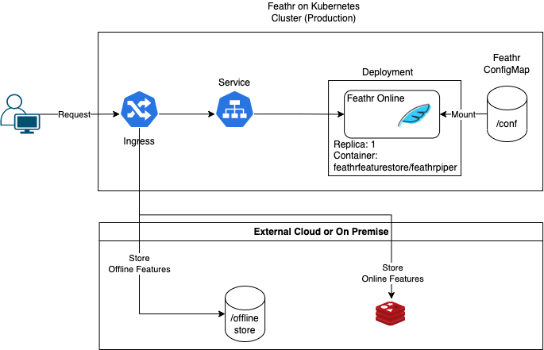

# feathr-e2e

This project contains the following containers:

* **Feathr UI**: Feathr UI to visualize features and its data sources.
    * Image: feathr-online-ui-demo:main
    * Database Port: 8000
    * References: https://hub.docker.com/r/blrchen/feathr-online-ui-demo

* **Redis**: Online store for features.
    * Image: redis:latest
    * Port: 6379
    * References: https://hub.docker.com/_/redis

* **Feathr Online**: Feathr container to store and retrieves features.
    * Image: feathrfeaturestore/feathrpiper:latest
    * Port: 8000
    * References: https://hub.docker.com/r/feathrfeaturestore/feathrpiper

* **Jupyter Lab (Spark)**: Jupyter Lab which contains pyspark for interactive development. Comes with Feathr preinstalled.
    * Image: jupyter/pyspark-notebook:latest
    * Port: 8888
    * References: https://hub.docker.com/r/jupyter/pyspark-notebook

* **Model Server**: Serves model through API.
  * Image: windoze/model-server:latest
  * Port: 8001
  * References: https://hub.docker.com/r/windoze/model-server

* **Feathr Registry**: Feathr's feature vector registry.
  * Image: windoze/model-server:latest
  * Port: 8081
  * References: https://hub.docker.com/r/feathrfeaturestore/feathr-registry

## Architecture components

### Running Feathr locally with Docker Compose

During testing or POC, users are tempted to run and test Feathr quickly. We have provided a way to test Feathr with Docker compose. 

#### Starting Containers

Run `docker compose up` inside `feathr-e2e` for a quick demo. If you want to run in the background `docker-compose up -d`.
Navigate to `Jupyter Lab (Spark)` on http://localhost:8888 to run a quick Jupyter Notebook demo in `\work`, then navigate to `Feathr UI` on http://localhost:8000 to view the features committed to the registry. 

#### Stopping Containers

Run `docker compose down` to soft exit.

**Cloud**

This is the example of how Feathr should be deployed in a Kubernetes cluster. Attaching it

There are several architecture diagrams in the `architecture` folder that has recommended ways of integrating Feathr to your system:
1. [docker-compose](./architecture/docker-compose/docker-compose.drawio.png): Local Run with Docker Compose
1. [k8s-production]((./architecture/k8s-production/k8s-production.drawio.png): Running Feathr in production
1. [k8s-sandbox]((./architecture/k8s-sandbox/k8s-sandbox.drawio.png)): Running Feathr with all the containers listed in `docker-compose` on Kubernetes.
1. [k8s-azure-key-vault-integration]((./architecture/k8s-azure-key-vault-integration/k8s-azure-key-vault-integration.drawio.png)): Integrating Azure Key Vault into Azure Kubernetes Service to store secrets which are used by Feathr

## Registering Features